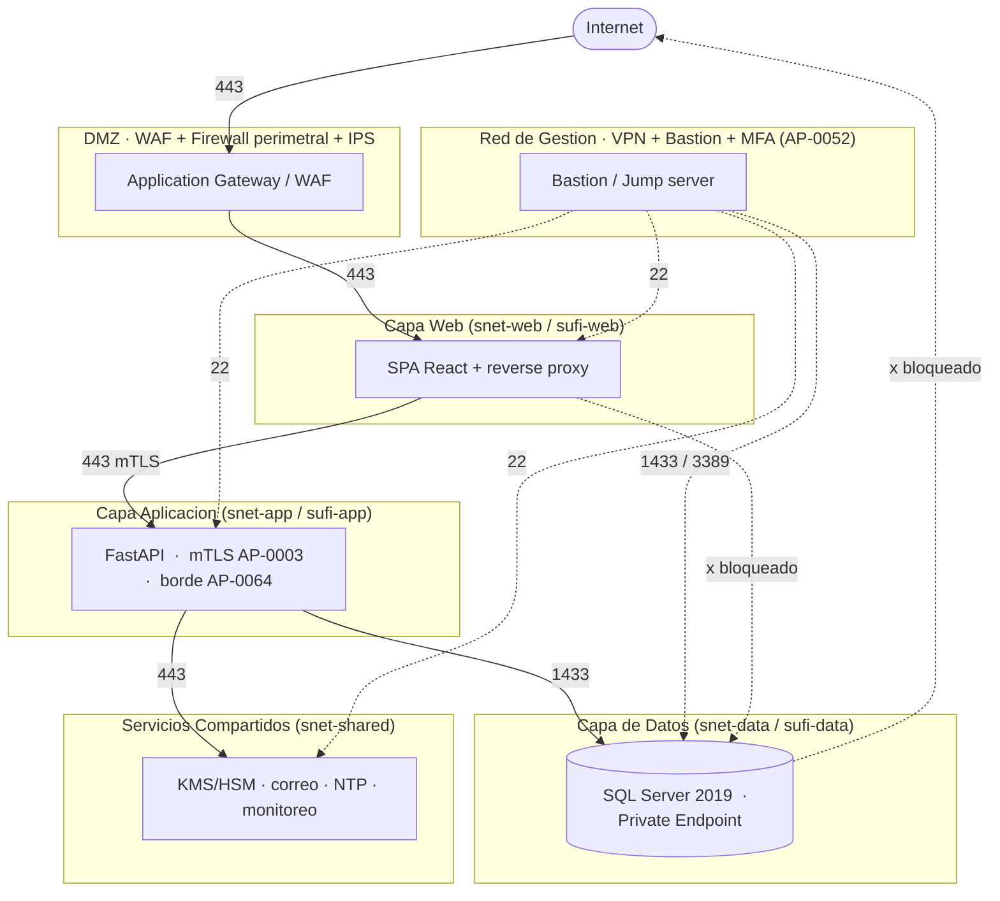

# AP-0150 -- Diagrama de zonas y flujos de red (SUFI)

Fuente canonica: [`inventario-segmentacion.yaml`](inventario-segmentacion.yaml). Este diagrama
es la representacion visual; el gate de CI (`validar_segmentacion.py`) valida el inventario, no
el diagrama. Mantener ambos sincronizados.

## Flujos bloqueados (invariantes verificadas por el gate)

| Origen | Destino | Motivo |
|---|---|---|
| Internet | Capa App / Datos / Compartidos | Ningun componente critico se expone directo a Internet |
| Capa Web | Capa de Datos | La web nunca habla directo con SQL Server |
| Capa de Datos | Internet | SQL sin salida a Internet (egress deny) |

## Correspondencia de artefactos

| Zona | Azure (`network.bicep`) | Kubernetes (`networkpolicies.yaml`) | AWS (`aws-security-groups.tf`) |
|---|---|---|---|
| DMZ | Application Gateway + WAF policy | Ingress controller (`zona: ingress`) | ALB + WAFv2 |
| Web | `snet-web` + `nsg-web` | ns `sufi-web` | `sg-sufi-web` |
| App | `snet-app` + `nsg-app` | ns `sufi-app` | `sg-sufi-app` |
| Datos | `snet-data` + `nsg-data` + Private Endpoint | ns `sufi-data` | `sg-sufi-data` |
| Compartidos | `snet-shared` | ns `zona: shared` | subnet privada compartida |
| Gestion | AzureBastionSubnet + GatewaySubnet | fuera del cluster | Bastion / SSM |
